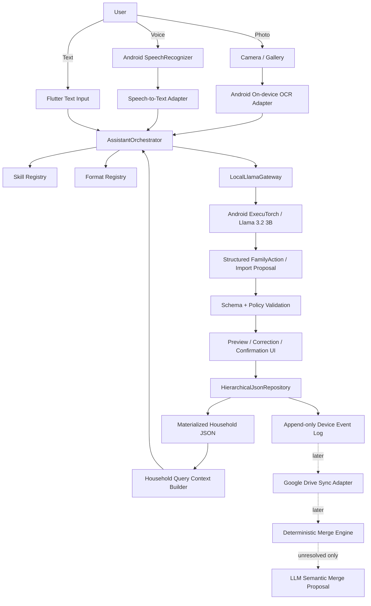
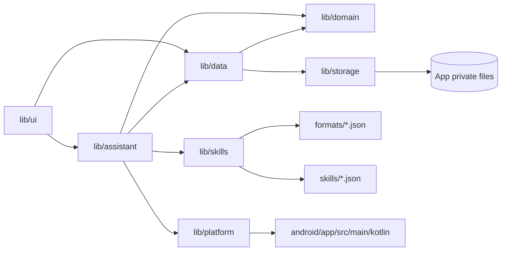
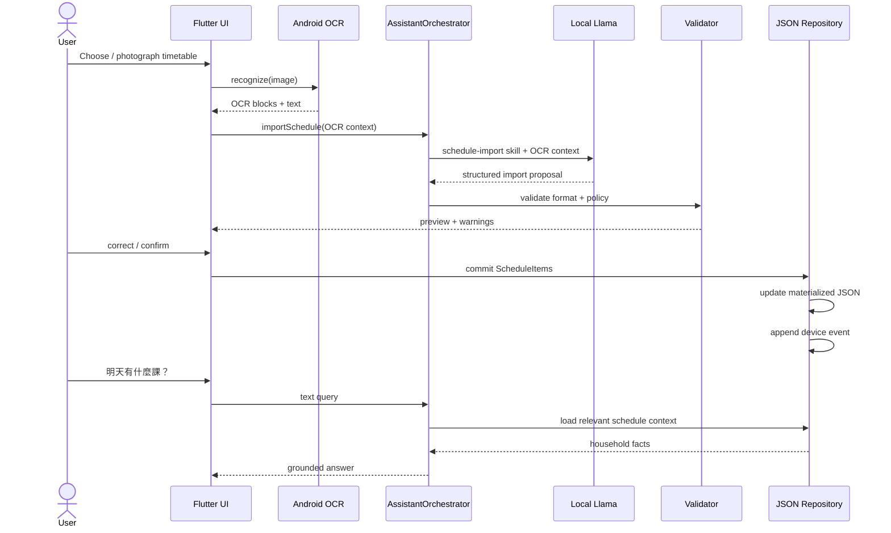

# Android MVP Architecture

This document is the implementation map for the first executable HouseHolder MVP.

## Vertical slice

## Flutter module map

## Planned code ownership

| Module | Responsibility |
| --- | --- |
| `lib/main.dart` | Android-first Flutter application shell |
| `lib/ui/` | Timetable import preview, household dashboard, assistant input, confirmations |
| `lib/assistant/assistant_orchestrator.dart` | Normalize text/voice/OCR input, choose skills, call LLM, return typed proposal |
| `lib/assistant/local_llama_gateway.dart` | Flutter MethodChannel contract for local Llama inference |
| `lib/platform/ocr_gateway.dart` | Flutter contract for Android OCR |
| `lib/platform/speech_gateway.dart` | Flutter contract for Android speech recognition |
| `lib/domain/` | Schedule, shopping, todo and FamilyAction types |
| `lib/data/` | Household repositories and query services |
| `lib/storage/` | Hierarchical JSON, canonicalization, hashes, events and later merge engine |
| `lib/skills/` | Skill registry and skill lifecycle |
| `skills/` | Declarative assistant skills |
| `formats/` | Versioned JSON schemas / format definitions |
| `android/...` | OCR, SpeechRecognizer and ExecuTorch native adapters |

## First executable path

## Important boundaries

1. The LLM never writes household storage directly.
2. OCR output is evidence, not authoritative structured data.
3. Any timetable import is previewed before commit.
4. Monetary totals in shopping are calculated deterministically, not by the LLM.
5. `summary.json` is derived/materialized data and may be rebuilt.
6. Append-only events are the future sync/merge input; each device owns its own event stream.
7. Semantic merge is only a proposal for conflicts deterministic rules cannot safely resolve.
8. New assistant abilities should normally arrive as declarative Skill + Format versions rather than changes to the orchestrator core.

## Immediate implementation backlog

- Complete the Flutter Android project shell and Gradle configuration.
- Add the first Android OCR implementation behind `OcrGateway`.
- Add image capture/gallery selection flow.
- Implement `ScheduleItem` Dart serialization matching `formats/schedule-item.v1.json`.
- Implement timetable import preview/correction screen.
- Implement persistent app-private hierarchical JSON repository.
- Append one device event for each confirmed mutation.
- Connect the existing Llama MethodChannel to a validated Android ExecuTorch runtime.
- Add text query for `明天小孩有什麼課？` using repository facts.
- Add Android speech input once the text path is stable.
