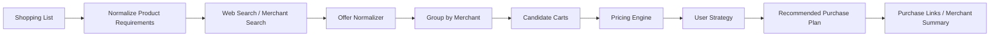

# Shopping Search & Optimization Strategy

HouseHolder V1 should begin with **web product discovery + merchant grouping + strategy-based recommendation**. Direct cart APIs can be added later per merchant.

## Goal

Given a household shopping list, find candidate purchase links and compare combinations across merchants according to the user's selected strategy.

Example input:

```text
shopping list:
- 牛奶 x2
- 衛生紙 x1
- 雞蛋 x1

strategy:
lowest_total_including_shipping
```

## Pipeline



## Offer format

```json
{
  "format": "householder.merchant-offer",
  "version": 1,
  "productRequirementId": "req-001",
  "merchantId": "merchant-a",
  "merchantName": "Example Shop",
  "title": "鮮乳 936ml",
  "unitPrice": 89,
  "quantity": 2,
  "shipping": {
    "known": true,
    "fee": 60,
    "freeShippingThreshold": 699
  },
  "availability": "in_stock",
  "url": "https://example.invalid/item/123",
  "observedAt": "2026-08-30T14:00:00+08:00"
}
```

Price/search observations are time-sensitive. The recommendation must retain `observedAt` and should never present an old observed price as guaranteed current checkout price.

## Merchant aggregation

Normalized offers are grouped by merchant:

```text
Merchant A
├─ 牛奶       $89 x2
├─ 衛生紙     $129
└─ 雞蛋       $75

Merchant B
├─ 牛奶       $85 x2
└─ 衛生紙     $119

Merchant C
└─ 雞蛋       $69
```

The system then constructs purchase plans rather than simply selecting the cheapest individual item.

## Initial strategies

### 1. Lowest total including shipping

Objective:

```text
minimize(
    sum(item subtotal)
  + sum(shipping fee per merchant)
  - known discounts
)
```

This strategy may split the list across multiple merchants when doing so lowers the final known total.

### 2. Lowest price with one-stop shopping

Only merchants that can satisfy all required items are candidates.

Objective:

```text
minimize(
    item subtotal
  + shipping fee
  - known discounts
)
subject to:
    every required item can be purchased from the same merchant
```

### 3. Fewest merchants first

Useful when convenience is more important than absolute minimum cost.

Lexicographic objective:

```text
1. minimize merchant count
2. minimize total known cost
```

### 4. User preference strategy (future)

Potential preferences:

- preferred merchants
- exclude merchants
- only official stores
- avoid long delivery times
- prefer pickup
- prioritize habitual brands

These should be explicit profile preferences, not inferred permanently from one purchase.

## Recommendation result

Example:

```json
{
  "strategy": "lowest_total_including_shipping",
  "estimatedTotal": 502,
  "currency": "TWD",
  "plans": [
    {
      "merchant": "Merchant A",
      "estimatedSubtotal": 307,
      "estimatedShipping": 60,
      "items": ["牛奶 x2", "衛生紙 x1"]
    },
    {
      "merchant": "Merchant C",
      "estimatedSubtotal": 69,
      "estimatedShipping": 66,
      "items": ["雞蛋 x1"]
    }
  ],
  "assumptions": [
    "Prices and shipping are based on latest observed web data",
    "Checkout promotions may change the final amount"
  ]
}
```

## Search first, cart later

V1 boundary:

```text
Search
  ↓
Normalize
  ↓
Compare
  ↓
Show merchant groups + purchase links
  ↓
User chooses
```

Later, merchants can implement optional adapters:

```text
ShoppingProvider
├─ search()
├─ resolveOffer()
├─ buildPurchaseLink()
├─ addToCart()      optional
└─ checkout()       future / high-risk
```

`addToCart` should only be enabled where an official supported integration exists and after user confirmation.

## Important optimization detail

Shipping fees make shopping comparison a **cart optimization problem**, not a per-product minimum-price problem.

For a small household list, V1 can enumerate candidate merchant combinations after pruning obviously dominated offers. If the list grows, this can be formulated as a constrained optimization problem.

The Pricing Engine must keep price calculation deterministic. The LLM may understand vague requirements such as "不要太差但便宜一點" or map products across merchant naming differences, but the arithmetic and final strategy scoring should be performed by code.

## Relation to skills

Shopping behavior should be implemented as skills:

```text
skills/shopping-search/
skills/shopping-compare/
skills/shopping-plan/
```

The strategy is data/configuration, for example:

```json
{
  "strategy": "lowest_total_including_shipping",
  "objective": ["known_total_cost"],
  "maxMerchants": null,
  "shippingIncluded": true
}
```

This allows HouseHolder to add new shopping strategies without rewriting the assistant core.
