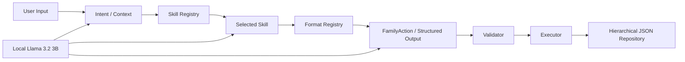

# Skill & Format Architecture

HouseHolder should expand primarily through **skills** and **format specifications**, not by hard-coding every household scenario into the app.

The assistant runtime is split into:



## 1. Skill

A skill describes **what the butler knows how to do**.

Examples:

```text
skills/
├─ schedule/
│  ├─ SKILL.md
│  ├─ actions.schema.json
│  └─ examples.jsonl
├─ shopping/
│  ├─ SKILL.md
│  ├─ actions.schema.json
│  └─ strategies.json
├─ todo/
│  └─ ...
└─ smart-merge/
   └─ ...
```

A skill should contain at minimum:

- name / version
- purpose
- triggers / examples
- required input formats
- produced action formats
- allowed tools / capabilities
- validation rules
- confirmation requirements
- examples and counterexamples

The LLM may propose a new skill or a new version, but **must not silently activate arbitrary generated logic**.

Recommended lifecycle:


For low-risk household formatting skills, approval can eventually be lightweight. For shopping, deletion, external actions, authentication, or other side effects, explicit confirmation remains required.

## 2. Format specification

A format describes **how household information is represented**.

Examples:

```text
formats/
├─ schedule/
│  ├─ v1.schema.json
│  ├─ v1.md
│  └─ migrations/
├─ shopping-item/
├─ todo/
├─ household-event/
└─ merchant-offer/
```

Formats are versioned independently from skills.

Example schedule record:

```json
{
  "format": "householder.schedule-item",
  "version": 1,
  "id": "schedule-001",
  "childId": "child-001",
  "dayOfWeek": 1,
  "startTime": "08:00",
  "endTime": "08:40",
  "subject": "數學",
  "validFrom": "2026-09-01",
  "validUntil": "2027-01-20"
}
```

## 3. Self-expanding capability

The butler should be able to detect repeated household patterns and suggest a new skill or format.

Example:

```text
User repeatedly records:
"瓦斯抄表"
"水費繳費"
"電費繳費"

        ↓

Assistant detects recurring utility workflow

        ↓

Proposes:
skill: household-bills
format: recurring-bill/v1
```

The generated proposal should include rationale, schema, examples and migrations.

## 4. Safety boundary

Principle:

> Model proposes; deterministic runtime validates and executes.

The model may create or modify declarative skill/format files, but should not gain unrestricted code execution, filesystem access, credentials, or arbitrary network access.

A capability declaration can look like:

```json
{
  "skill": "shopping-compare",
  "capabilities": [
    "web.search",
    "merchant.read"
  ],
  "requiresConfirmation": [
    "cart.add",
    "purchase.checkout"
  ]
}
```

## 5. Relation to sync

Skills and formats should themselves be syncable and versioned.

Suggested hierarchy:

```text
HouseHolder/
├─ system/
│  ├─ skills/
│  ├─ formats/
│  └─ registry.json
├─ family/
├─ shopping/
├─ todos/
└─ sync/
```

Changes to skills/formats should also create append-only events so both spouses converge on the same capability set.
