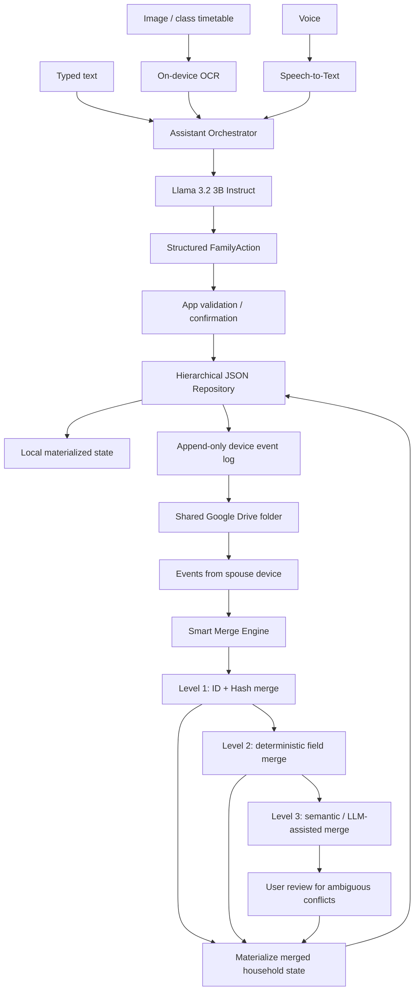
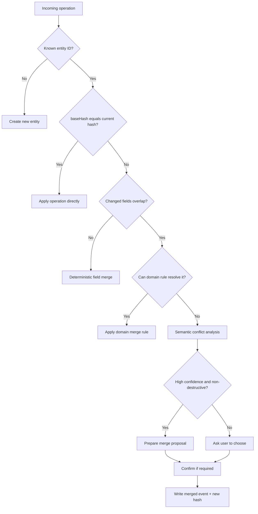
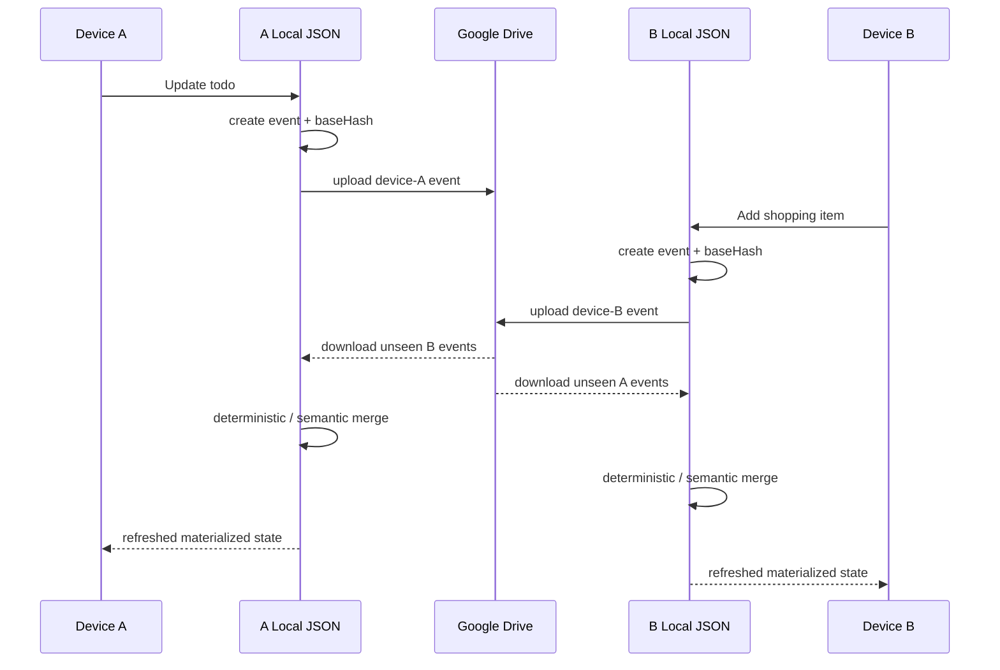

# HouseHolder Smart Merge Architecture

> Working design document. This file is intentionally easy to evolve while requirements are still being discussed.

## 1. High-level flow



## 2. Storage layout

```text
HouseHolder/
├─ manifest.json
├─ family/
│  ├─ members.jsonl
│  └─ children/
│     └─ child-001/
│        ├─ summary.json
│        ├─ schedule/
│        │  ├─ summary.json
│        │  └─ 2026-semester-1.jsonl
│        └─ events/
│           └─ 2026-09.jsonl
├─ shopping/
│  ├─ summary.json
│  └─ items.jsonl
├─ todos/
│  ├─ summary.json
│  └─ items.jsonl
└─ sync/
   ├─ devices.json
   ├─ events/
   │  ├─ device-a/
   │  └─ device-b/
   └─ checkpoints/
```

The key idea is to separate **summary/index data** from **detail data**. The assistant should only load the minimum context required for the current request.

## 3. Record identity and hashing

Each logical entity must have a stable ID. A hash should represent the canonicalized semantic record, not the raw line text.

```json
{
  "id": "shopping-item-001",
  "version": 7,
  "data": {
    "name": "牛奶",
    "quantity": 2,
    "status": "pending"
  },
  "hash": "sha256-of-canonical-json",
  "createdBy": "device-a",
  "createdAt": "2026-08-30T14:10:00+08:00",
  "modifiedBy": "device-b",
  "modifiedAt": "2026-08-30T14:12:00+08:00",
  "deleted": false
}
```

Before hashing, JSON should be canonicalized: stable property order, normalized dates, normalized null/empty rules, normalized numeric representation, and UTF-8 encoding.

## 4. Change events

Devices do not overwrite the same shared JSON file directly. Each device appends its own operations.

```json
{
  "opId": "01J...",
  "entityType": "shoppingItem",
  "entityId": "shopping-item-001",
  "operation": "update",
  "baseHash": "previous-record-hash",
  "patch": {
    "quantity": 2
  },
  "deviceId": "device-a",
  "timestamp": "2026-08-30T14:10:00+08:00"
}
```

Supported operation types for V1:

```text
create
update
delete
```

Deletes should initially be represented as tombstones rather than immediately removing history.

## 5. Merge strategy



### Level 1 — deterministic identity/hash merge

Use stable entity ID, `baseHash`, current hash and operation ID. Duplicate operations are ignored by `opId`.

### Level 2 — deterministic field merge

If two devices changed different fields from the same base version, merge automatically.

Example:

```text
Base: quantity=1, brand=null
Dad: quantity=2
Mom: brand=光泉
Result: quantity=2, brand=光泉
```

If both modify the same field differently, do not silently use last-write-wins unless a specific domain rule explicitly allows it.

### Level 3 — semantic merge

The LLM can help detect semantic duplication or propose a resolution, but it should not silently perform destructive merge decisions.

Example:

```text
A: 星期五繳小明學費
B: 小明學費週五以前要繳
```

The assistant may propose that these are the same todo and return a confidence score. The application decides whether user confirmation is required.

## 6. Merge principles

1. **Model proposes; application decides.**
2. Never let the LLM directly rewrite the synced document store.
3. Every mutation is reproducible from an operation/event.
4. Every operation has a unique `opId` and stable `deviceId`.
5. Prefer field-level merge over whole-document replacement.
6. Deletion uses tombstones first so offline devices do not resurrect deleted records accidentally.
7. Semantic merge is the last layer, not the first layer.
8. Ambiguous destructive conflicts must be surfaced to a person.
9. Materialized `summary.json` files are rebuildable indexes, not the source of truth.
10. Google Drive is a transport/shared persistence layer; merge semantics belong to HouseHolder.

## 7. Proposed sync model



## 8. Open design questions

These are intentionally unresolved so they can be decided before implementation:

- Should operation IDs use UUIDv7, ULID, or another sortable identifier?
- Should the source of truth be only events, or events plus periodic snapshots?
- How frequently should logs be compacted into snapshots?
- Should each entity type define its own merge policy?
- Which conflicts are safe to auto-merge without user confirmation?
- How should a newly paired spouse device bootstrap a large history efficiently?
- How should encryption keys be paired/exchanged between family devices?
- How should Google Drive file renames/moves or accidental deletion be recovered?
- How long should tombstones be retained?
- Should OCR source images be retained, encrypted, or deleted after successful timetable import?

## 9. Current V1 direction

```text
Input
  = image + voice + text

Understanding
  = OCR / Speech-to-Text + Llama 3.2 3B

Persistence
  = hierarchical local JSON + event log

Sharing
  = Google Drive

Concurrency
  = stable IDs + canonical hashes + baseHash + device event logs

Merge
  = deterministic first, semantic LLM-assisted merge only when necessary
```
